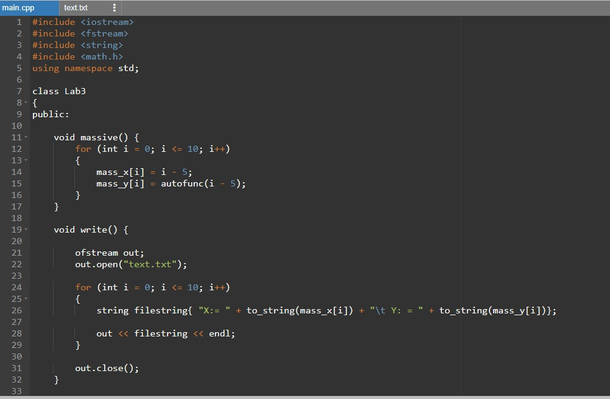
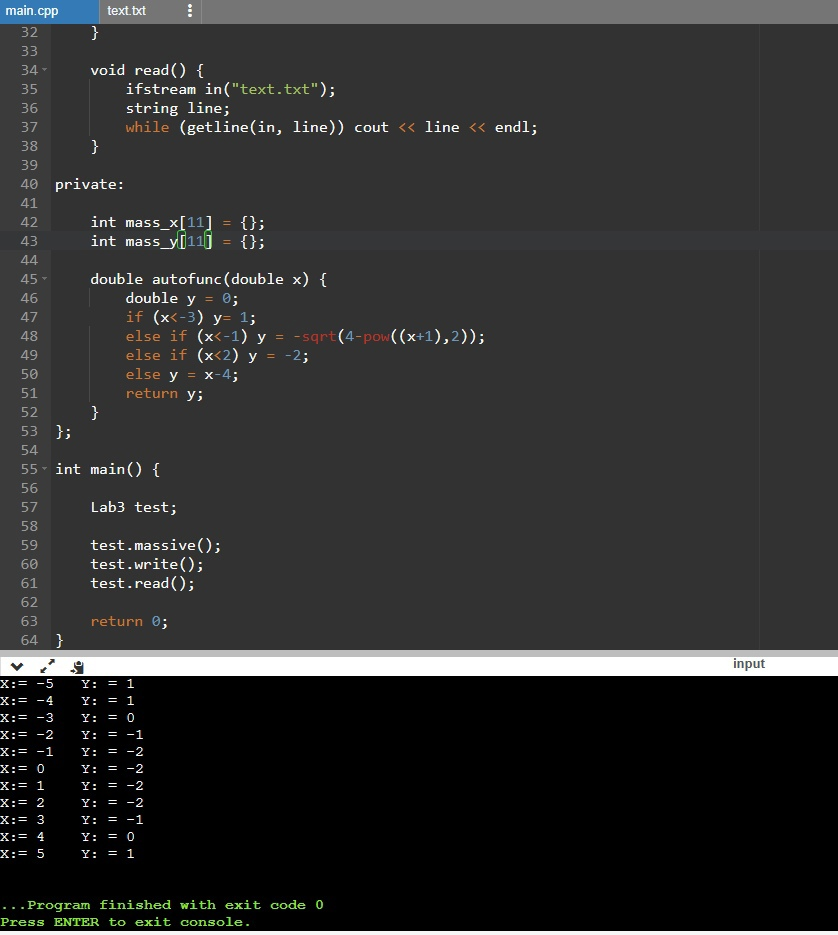

# Лабораторная работа 3
## Использование классов.
В данной работе необходимо было ознакомится со структурой классов, и программу полученную в ходе прошлых работ интегрировать в созданный класс.
## код выполненной работы

